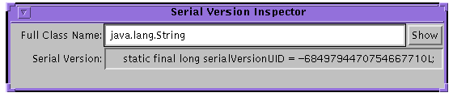

---
# Copyright (c) 2005, 2017, Oracle and/or its affiliates. All rights reserved.
# DO NOT ALTER OR REMOVE COPYRIGHT NOTICES OR THIS FILE HEADER.
#
# This code is free software; you can redistribute it and/or modify it
# under the terms of the GNU General Public License version 2 only, as
# published by the Free Software Foundation.
#
# This code is distributed in the hope that it will be useful, but WITHOUT
# ANY WARRANTY; without even the implied warranty of MERCHANTABILITY or
# FITNESS FOR A PARTICULAR PURPOSE.  See the GNU General Public License
# version 2 for more details (a copy is included in the LICENSE file that
# accompanied this code).
#
# You should have received a copy of the GNU General Public License version
# 2 along with this work; if not, write to the Free Software Foundation,
# Inc., 51 Franklin St, Fifth Floor, Boston, MA 02110-1301 USA.
#
# Please contact Oracle, 500 Oracle Parkway, Redwood Shores, CA 94065 USA
# or visit www.oracle.com if you need additional information or have any
# questions.

include-before: '[CONTENTS](index.html) | [PREV](input.html) | [NEXT](version.html)'
include-after: '[CONTENTS](index.html) | [PREV](input.html) | [NEXT](version.html)'

title: 'Java Object Serialization Specification: 4 - Class Descriptors'
---

-   [The ObjectStreamClass Class](#the-objectstreamclass-class)
-   [Dynamic Proxy Class Descriptors](#dynamic-proxy-class-descriptors)
-   [Serialized Form](#serialized-form)
-   [The ObjectStreamField Class](#the-objectstreamfield-class)
-   [Inspecting Serializable Classes](#inspecting-serializable-classes)
-   [Stream Unique Identifiers](#stream-unique-identifiers)

-------------------------------------------------------------------------------

## 4.1 The ObjectStreamClass Class

The `ObjectStreamClass` provides information about classes that are saved in a
Serialization stream. The descriptor provides the fully-qualified name of the
class and its serialization version UID. A `SerialVersionUID` identifies the
unique original class version for which this class is capable of writing
streams and from which it can read.

```
package java.io;

public class ObjectStreamClass
{
    public static ObjectStreamClass lookup(Class cl);

        public static ObjectStreamClass lookupAny(Class cl);

    public String getName();

    public Class forClass();

    public ObjectStreamField[] getFields();

    public long getSerialVersionUID();

    public String toString();
}
```

The `lookup` method returns the `ObjectStreamClass` descriptor for the
specified class in the virtual machine. If the class has defined
`serialVersionUID` it is retrieved from the class. If the `serialVersionUID` is
not defined by the class, it is computed from the definition of the class in
the virtual machine. *I*f the specified class is not serializable or
externalizable, *null* is returned.

The `lookupAny` method behaves like the `lookup` method, except that it returns
the descriptor for any class, regardless of whether it implements
`Serializable`. The `serialVersionUID` of a class that does not implement
`Serializable` is *0L.*

The `getName` method returns the name of the class, in the same format that is
used by the `Class.getName` method.

The `forClass` method returns the `Class` in the local virtual machine if one
was found by `ObjectInputStream.resolveClass` method. Otherwise, it returns
*null*.

The `getFields` method returns an array of `ObjectStreamField` objects that
represent the serializable fields of this class.

The `getSerialVersionUID` method returns the `serialVersionUID` of this class.
Refer to [Section 4.6, "Stream Unique
Identifiers"](#stream-unique-identifiers). If not specified by the class, the
value returned is a hash computed from the class's name, interfaces, methods,
and fields using the Secure Hash Algorithm (SHA) as defined by the National
Institute of Standards.

The `toString` method returns a printable representation of the class
descriptor including the name of the class and the `serialVersionUID`.

## 4.2 Dynamic Proxy Class Descriptors

ObjectStreamClass descriptors are also used to provide information about
dynamic proxy classes (e.g., classes obtained via calls to the getProxyClass
method of java.lang.reflect.Proxy) saved in a serialization stream. A dynamic
proxy class itself has no serializable fields and a serialVersionUID of 0L. In
other words, when the Class object for a dynamic proxy class is passed to the
static lookup method of ObjectStreamClass, the returned ObjectStreamClass
instance will have the following properties:

-   Invoking its getSerialVersionUID method will return 0L.
-   Invoking its getFields method will return an array of length zero.
-   Invoking its getField method with any String argument will return null.

## 4.3 Serialized Form

The serialized form of an ObjectStreamClass instance depends on whether or not
the Class object it represents is serializable, externalizable, or a dynamic
proxy class.

When an `ObjectStreamClass` instance that does not represent a dynamic proxy
class is written to the stream, it writes the class name and
`serialVersionUID`, flags, and the number of fields. Depending on the class,
additional information may be written:

-   For non-serializable classes, the number of fields is always zero. Neither
    the `SC_SERIALIZABLE` nor the `SC_EXTERNALIZABLE` flag bits are set.

-   For serializable classes, the `SC_SERIALIZABLE` flag is set, the number of
    fields counts the number of serializable fields and is followed by a
    descriptor for each serializable field. The descriptors are written in
    canonical order. The descriptors for primitive typed fields are written
    first sorted by field name followed by descriptors for the object typed
    fields sorted by field name. The names are sorted using `String.compareTo`.
    For details of the format, refer to [Section 6.4, "Grammar for the Stream
    Format"](protocol.html#grammar-for-the-stream-format).

-   For externalizable classes, flags includes the `SC_EXTERNALIZABLE` flag,
    and the number of fields is always zero.

-   For enum types, flags includes the `SC_ENUM` flag, and the number of fields
    is always zero.

When an ObjectOutputStream serializes the ObjectStreamClass descriptor for a
dynamic proxy class, as determined by passing its Class object to the
isProxyClass method of java.lang.reflect.Proxy, it writes the number of
interfaces that the dynamic proxy class implements, followed by the interface
names. Interfaces are listed in the order that they are returned by invoking
the getInterfaces method on the Class object of the dynamic proxy class.

The serialized representations of ObjectStreamClass descriptors for dynamic
proxy classes and non-dynamic proxy classes are differentiated through the use
of different typecodes (`TC_PROXYCLASSDESC` and `TC_CLASSDESC`, respectively);
for a more detailed specification of the grammar, see [Section 6.4, "Grammar
for the Stream Format"](protocol.html#grammar-for-the-stream-format).

## 4.4 The ObjectStreamField Class

An `ObjectStreamField` represents a serializable field of a serializable class.
The serializable fields of a class can be retrieved from the
`ObjectStreamClass`.

The special static serializable field, `serialPersistentFields`, is an array of
`ObjectStreamField` components that is used to override the default
serializable fields.

```
package java.io;

public class ObjectStreamField implements Comparable {

    public ObjectStreamField(String fieldName,
                             Class fieldType);

    public ObjectStreamField(String fieldName,
                             Class fieldType,
                             boolean unshared);

    public String getName();

    public Class getType();

    public String getTypeString();

    public char getTypeCode();

    public boolean isPrimitive();

    public boolean isUnshared();

    public int getOffset();

    protected void setOffset(int offset);

    public int compareTo(Object obj);

    public String toString();
}
```

`ObjectStreamField` objects are used to specify the serializable fields of a
class or to describe the fields present in a stream. Its constructors accept
arguments describing the field to represent: a string specifying the name of
the field, a `Class` object specifying the type of the field, and a `boolean`
flag (implicitly `false` for the two-argument constructor) indicating whether
or not values of the represented field should be read and written as "unshared"
objects if default serialization/deserialization is in use (see the
descriptions of the `ObjectInputStream.readUnshared` and
`ObjectOutputStream.writeUnshared` methods in [Section 3.1, "The
ObjectInputStream Class"](input.html#the-objectinputstream-class) and [Section
2.1, "The ObjectOutputStream Class"](output.html#the-objectoutputstream-class),
respectively).

The `getName` method returns the name of the serializable field.

The `getType` method returns the type of the field.

The `getTypeString` method returns the type signature of the field.

The `getTypeCode` method returns a character encoding of the field type ('`B`'
for `byte`, '`C`' for `char`, '`D`' for `double`, '`F`' for `float`, '`I`' for
`int`, '`J`' for `long`, '`L`' for non-array object types, '`S`' for `short`,
'`Z`' for `boolean`, and '`[`' for arrays).

The `isPrimitive` method returns `true` if the field is of primitive type, or
`false` otherwise.

The `isUnshared` method returns `true` if values of the field should be written
as "unshared" objects, or `false` otherwise.

The `getOffset` method returns the offset of the field's value within instance
data of the class defining the field.

The `setOffset` method allows `ObjectStreamField` subclasses to modify the
offset value returned by the `getOffset` method.

The `compareTo` method compares `ObjectStreamFields` for use in sorting.
Primitive fields are ranked as "smaller" than non-primitive fields; fields
otherwise equal are ranked alphabetically.

The `toString` method returns a printable representation with name and type.

## 4.5 Inspecting Serializable Classes

The program *serialver* can be used to find out if a class is serializable and
to get its `serialVersionUID`. When invoked with the-show option, it puts up a
simple user interface. To find out if a class is serializable and to find out
its *serialVersionUID*`,` enter its full class name, then press either the
Enter or the Show button. The string printed can be copied and pasted into the
evolved class.

>   

When invoked on the command line with one or more class names, serialver prints
the `serialVersionUID` for each class in a form suitable for copying into an
evolving class. When invoked with no arguments, it prints a usage line.

## 4.6 Stream Unique Identifiers

Each versioned class must identify the original class version for which it is
capable of writing streams and from which it can read. For example, a versioned
class must declare:

```
private static final long serialVersionUID = 3487495895819393L;
```

The stream-unique identifier is a 64-bit hash of the class name, interface
class names, methods, and fields. The value must be declared in all versions of
a class except the first. It may be declared in the original class but is not
required. The value is fixed for all compatible classes. If the SUID is not
declared for a class, the value defaults to the hash for that class. The
`serialVersionUID` for dynamic proxy classes and enum types always have the
value *0L*. Array classes cannot declare an explicit `serialVersionUID`, so
they always have the default computed value, but the requirement for matching
`serialVersionUID` values is waived for array classes.

**Note:** It is strongly recommended that all serializable classes explicitly
declare `serialVersionUID` values, since the default `serialVersionUID`
computation is highly sensitive to class details that may vary depending on
compiler implementations, and can thus result in unexpected `serialVersionUID`
conflicts during deserialization, causing deserialization to fail.

The initial version of an `Externalizable` class must output a stream data
format that is extensible in the future. The initial version of the method
`readExternal` has to be able to read the output format of all future versions
of the method `writeExternal`.

The `serialVersionUID` is computed using the signature of a stream of bytes
that reflect the class definition. The National Institute of Standards and
Technology (NIST) Secure Hash Algorithm (SHA-1) is used to compute a signature
for the stream. The first two 32-bit quantities are used to form a 64-bit hash.
A `java.lang.DataOutputStream` is used to convert primitive data types to a
sequence of bytes. The values input to the stream are defined by the Java
Virtual Machine (VM) specification for classes. Class modifiers may include the
`ACC_PUBLIC`, `ACC_FINAL`, `ACC_INTERFACE`, and `ACC_ABSTRACT` flags; other
flags are ignored and do not affect `serialVersionUID` computation. Similarly,
for field modifiers, only the `ACC_PUBLIC`, `ACC_PRIVATE`, `ACC_PROTECTED`,
`ACC_STATIC`, `ACC_FINAL`, `ACC_VOLATILE`, and `ACC_TRANSIENT` flags are used
when computing `serialVersionUID` values. For constructor and method modifiers,
only the `ACC_PUBLIC`, `ACC_PRIVATE`, `ACC_PROTECTED`, `ACC_STATIC`,
`ACC_FINAL`, `ACC_SYNCHRONIZED`, `ACC_NATIVE`, `ACC_ABSTRACT` and `ACC_STRICT`
flags are used. Names and descriptors are written in the format used by the
`java.io.DataOutputStream.writeUTF` method.

The sequence of items in the stream is as follows:

1.  The class name.

2.  The class modifiers written as a 32-bit integer.

3.  The name of each interface sorted by name.

4.  For each field of the class sorted by field name (except `private static`
    and `private transient` fields:

    a.  The name of the field.

    b.  The modifiers of the field written as a 32-bit integer.

    c.  The descriptor of the field.

5.  If a class initializer exists, write out the following:

    a.  The name of the method, `<clinit>`.

    b.  The modifier of the method, `java.lang.reflect.Modifier.STATIC`,
        written as a 32-bit integer.

    c.  The descriptor of the method, `()V`.

6.  For each non-`private` constructor sorted by method name and signature:

    a.  The name of the method, `<init>`.

    b.  The modifiers of the method written as a 32-bit integer.

    c.  The descriptor of the method.

7.  For each non-`private` method sorted by method name and signature:

    a.  The name of the method.

    b.  The modifiers of the method written as a 32-bit integer.

    c.  The descriptor of the method.

8.  The SHA-1 algorithm is executed on the stream of bytes produced by
    `DataOutputStream` and produces five 32-bit values `sha[0..4]`.

9.  The hash value is assembled from the first and second 32-bit values of the
    SHA-1 message digest. If the result of the message digest, the five 32-bit
    words `H0 H1 H2 H3 H4`, is in an array of five `int` values named `sha`,
    the hash value would be computed as follows:

```
      long hash = ((sha[0] >>> 24) & 0xFF) |
                  ((sha[0] >>> 16) & 0xFF) << 8 |
                  ((sha[0] >>> 8) & 0xFF) << 16 |
                  ((sha[0] >>> 0) & 0xFF) << 24 |
                  ((sha[1] >>> 24) & 0xFF) << 32 |
                  ((sha[1] >>> 16) & 0xFF) << 40 |
                  ((sha[1] >>> 8) & 0xFF) << 48 |
                  ((sha[1] >>> 0) & 0xFF) << 56;
```

-------------------------------------------------------------------------------

*[Copyright](../../../legal/SMICopyright.html) &copy; 2005, 2017, Oracle
and/or its affiliates. All rights reserved.*
